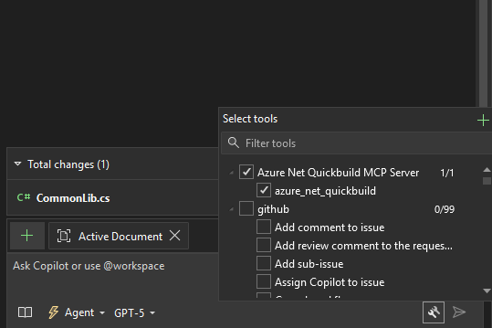

# INSTALLATION

To install this MCP on your computer/repo, you need to do the following

1: have this repo downloaded

2: Go ahead and create a file called .mcp.json in your C:/Users/**USERNAME*/ directory 

Mine looks like this: "C:\Users\mattsteele\.mcp.json"

I have an example file of this in the repo as well, MAKE SURE TO ADJUST YOUR PATH of the server itself when making it, and remove the github one if you don't want to use that MCP(as it is separate)

3: Once you have done this, Open visual studio and then open copilot chat. Once you have it open, click on the wrench icon and you should now see the server. 



Make sure that the checkbox itself is checked on to enable the MCP. After this please go ahead and click on the arrow next to the MCP to pull up the menu for it, and click restart. This ensures the server is running

4: Next, you will need to add copilot instructions to make your copilot use this tool as it does not consciously check for it. I have an example markdown to paste. For this, navigate to your repository(NOT THE ROOT AREA) and inside of the service project you work on, go ahead and make a folder called .github. Inside of this folder, make a markdown called "copilot-instructions.md." Depending on your team, this may already exist. If it already exists, paste the example section under it. If not, then go ahead and just make it and paste my example as the only file contents.

5: once you have done this, go ahead and open a new chat session and try the command "can you see if this works". If it prompts to use the tool, your setup worked! 

## Troubleshooting

If you run into troubleshooting issues, feel free to ping Matt Steele(ALIAS mattsteele@microsoft.com). 


### Other Info (disregard unless curious)

# Azure .NET QuickBuild MCP Tool

This MCP tool provides quick .NET project compilation testing using Azure QuickBuild, helping you validate builds and identify compilation errors efficiently.

## Usage

### Basic Usage
By default, the tool runs a standard quickbuild:
```
Use the azure_net_quickbuild tool to check if my .NET project compiles
```

### Parameters
- `project_directory` (required): Absolute path to your .NET project directory
- `timeout_minutes` (optional, default: 10): Maximum build time in minutes
- `build_mode` (optional, default: "standard"): Build configuration

### Build Modes

#### Standard Build (Default)
```
Check if my project at /path/to/project compiles
```
- Runs: `quickbuild`
- Best for: General compilation validation

#### Debug Build
When you need detailed build information:
```
Run a debug build on my project to see detailed compilation info
```
- Runs: `quickbuild -debug`
- Use when: You need verbose build output for troubleshooting

#### No Tests Build  
When you want to skip tests for faster feedback:
```
Check if my project compiles but skip the tests
```
- Runs: `quickbuild -notest -debug`
- Use when: You only want compilation validation without test execution

## What You Get

The tool returns:
- ✅ **Build success/failure status**
- 📋 **Structured error list** with file paths and line numbers
- 🔍 **Filtered error output** (only the relevant error messages)
- 📊 **Clear status message**

## When to Use This Tool

- **Before committing** code changes
- **After refactoring** to validate compilation
- **Quick syntax checking** without waiting for full CI builds
- **Rapid development** feedback loops

## Examples

### Quick Compilation Check
```
Can you check if my .NET project at C:\MyProject compiles?
```

### Debug Build for Troubleshooting
```
I'm having build issues. Run a debug build on my project at C:\MyProject to see what's wrong.
```

### Skip Tests for Speed
```
Just check compilation without running tests for the project in C:\MyProject
```

## Tips

- The tool automatically detects and parses .NET compilation errors
- Error output is optimized for readability and focuses on actionable information
- Build timeouts default to 10 minutes but can be adjusted if needed
- Works with any .NET project that supports Azure QuickBuild

---

This tool provides fast feedback for .NET development without the overhead of full CI/CD pipeline execution.

This Model Context Protocol (MCP) server provides integration with Azure .NET QuickBuild for testing project compilation from Copilot CLI.

## Overview

The server exposes a single tool `azure_net_quickbuild` that:
- Runs `quickbuild -debug` in a specified project directory
- Captures and parses compilation output 
- Returns structured results indicating success/failure
- Extracts error details with file locations and line numbers
- Provides clear status messages for Copilot CLI

## Tool: `azure_net_quickbuild`

### Parameters

- `project_directory` (required): Absolute path to the directory containing the .NET project
- `timeout_minutes` (optional): Maximum time to wait for build completion (default: 10 minutes)

### Returns

```json
{
  "success": boolean,
  "errors": [
    {
      "file": "string",
      "line": number | null,
      "message": "string"
    }
  ],
  "raw_output": "string",
  "status": "string"
}
```

### Response Format

#### Success Response
```json
{
  "success": true,
  "errors": [],
  "raw_output": "...",
  "status": "✅ Build completed successfully - No errors found"
}
```

#### Error Response
```json
{
  "success": false,
  "errors": [
    {
      "file": "MyProject.cs",
      "line": 15,
      "message": "The name 'invalidVariable' does not exist in the current context"
    }
  ],
  "raw_output": "...",
  "status": "❌ Build failed with 1 error(s)"
}
```

## Error Parsing

The server intelligently parses various .NET compilation error formats:

- `filepath(line,column): error CS####: message`
- `filepath(line): error CS####: message`  
- `error CS####: message`
- `filepath: error: message`
- `Build FAILED` messages

## Usage with Copilot CLI

When Copilot CLI needs to test if a .NET project compiles, it can call this tool:

```json
{
  "tool": "azure_net_quickbuild",
  "arguments": {
    "project_directory": "/path/to/your/dotnet/project",
    "timeout_minutes": 5
  }
}
```

The tool will:
1. Validate the project directory exists
2. Run `quickbuild -debug` in that directory
3. Wait for completion (up to timeout)
4. Parse output for compilation errors
5. Return structured results

## Prerequisites

- Azure QuickBuild tools must be installed and available in PATH
- `quickbuild` command must be accessible from the target project directory
- Project directory must contain a valid .NET project structure

## Error Handling

The server handles various error conditions:

- **Directory not found**: Returns error if project directory doesn't exist
- **Invalid directory**: Returns error if path is not a directory
- **Command not found**: Returns error if `quickbuild` is not installed
- **Timeout**: Kills process and returns timeout error if build takes too long
- **Unexpected errors**: Catches and reports any other exceptions

## Testing

Run the test suite to verify functionality:

```bash
cd mcp_servers/azure-net-quickbuild/src
python test_server.py
```

## Server Startup

To run the MCP server:

```bash
cd mcp_servers/azure-net-quickbuild/src
python server.py
```

The server will start in STDIO mode and wait for MCP client connections.
